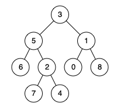

# Arts-007

## 1.Algorithm
236. [Lowest Common Ancestor of a Binary Tree](https://leetcode.com/problems/lowest-common-ancestor-of-a-binary-tree/)

Given a binary tree, find the lowest common ancestor (LCA) of two given nodes in the tree.

According to the [definition of LCA on Wikipedia](https://en.wikipedia.org/wiki/Lowest_common_ancestor): “The lowest common ancestor is defined between two nodes p and q as the lowest node in T that has both p and q as descendants (where we allow **a node to be a descendant of itself**).”

Given the following binary tree: root = [3,5,1,6,2,0,8,null,null,7,4]

    
**Example 1:**
    
```
Input: root = [3,5,1,6,2,0,8,null,null,7,4], p = 5, q = 1
Output: 3
Explanation: The LCA of nodes 5 and 1 is 3.
```

**Example 2:**

```
Input: root = [3,5,1,6,2,0,8,null,null,7,4], p = 5, q = 4
Output: 5
Explanation: The LCA of nodes 5 and 4 is 5, since a node can be a descendant of itself according to the LCA definition.
```

**Note:**

- All of the nodes' values will be unique.

- p and q are different and both values will exist in the binary tree.

  ​    

**My Solution**

```Go
func lowestCommonAncestor(root, p, q *TreeNode) *TreeNode {
	if root == nil {
		return nil
	} else if root.Val == p.Val || root.Val == q.Val {
		return root
	}
	leftNode := lowestCommonAncestor(root.Left, p, q)
	rightNode := lowestCommonAncestor(root.Right, p, q)
	if leftNode == nil {
		return rightNode
	} else if rightNode == nil {
		return leftNode
	}
	return root
}
```


## 2.Review

[Efficiently Checking for an Empty List in Python](https://medium.com/swlh/efficiently-checking-for-an-empty-list-in-python-76b76099fbd3)
**Python判断列表为空的方法**

本文探讨了3张判断列表为空的方法，通过dis模块分析bytecode之间的区别，并给出建议。适合Python优化

```Python
def explicit_list(a):
    if a == []:
        return True
    return False
def explicit_len(a):
    if len(a) == 0:
        return True
    return False
def implicit_bool(a):
    if a:
        return True
    return False

explicit_list：
>>> import dis
>>> def explicit_list(a):
...     if a == []:
...         return True
...     return False
...
>>> dis.dis(explicit_list)
  2           0 LOAD_FAST                0 (a)
              2 BUILD_LIST               0
              4 COMPARE_OP               2 (==)
              6 POP_JUMP_IF_FALSE       12
  3           8 LOAD_CONST               1 (True)
             10 RETURN_VALUE
  4     >>   12 LOAD_CONST               2 (False)
             14 RETURN_VALUE
这是复杂，效率最低的方案

explicit_len：
 ...     if len(a) == 0:
  2           0 LOAD_GLOBAL              0 (len)
              2 LOAD_FAST                0 (a)
              4 CALL_FUNCTION            1
              6 LOAD_CONST               1 (0)
              8 COMPARE_OP               2 (==)
             10 POP_JUMP_IF_FALSE       16        
需要调用len函数，性能略读低

implicit_bool：
...     if a:
  2           0 LOAD_FAST                0 (a)
              2 POP_JUMP_IF_FALSE        8
效率最高              
```
PEP8 Style Guide 建议：
```Python
For sequences, (strings, lists, tuples), use the fact that empty sequences are false.
Yes: if not seq:
     if seq:

No:  if len(seq):
     if not len(seq):
```

## 3.Tips
- **Go Error Wrapping(1.13)** 

    - **如何生成一个 Wrapping Error**
    ```Go
    	e := errors.New("原始错误e")
    	w := fmt.Errorf("Wrap错误:%w", e)
    	fmt.Println(w.Error())//Wrap错误:原始错误e
    	fmt.Println(errors.Unwrap(w))//原始错误e
    ```
    - **Error 判断与转换**
    ```Go
    func Is(err, target error) bool
    func As(err error, target interface{}) bool

    if err == os.ErrExist 
    --> 
    if errors.Is(err, os.ErrExist)
    
    if perr, ok := err.(*os.PathError); ok {
        fmt.Println(perr.Path)
    }
    -->
    var perr *os.PathError
    if errors.As(err, &perr) {
    fmt.Println(perr.Path)
    }
    ```


## 4.Share

[Go接口之nil != nil](https://mp.weixin.qq.com/s/ZBd1UcIJFk_DonkxVNgERA) 

Go语言中的interface是不是nil的条件，不单单是interface中的值是nil，类型还需要是nil才行。

- 指针的判断，都涉及到type和value
- 接口指针之间的判等，要基于type与value，一个不同则不等。
- 接口指针与其对应实现的结构体指针，可以进行判等操作。

[Go faq](https://golang.org/doc/faq) 很值得学习

```Go 
Example:

package main

import (
	"fmt"
	"reflect"
)

type IA interface {
	Print()
}

type A struct {

}

func (*A) Print(){
	fmt.Println("Hello A")
}

func GetA() IA  {
	var a *A = nil
	return a
}

func main()  {
	a := GetA()
	if a != nil {
		fmt.Printf("a!=nil a.type:%v, a.value:%v, a type:%v\n",reflect.TypeOf(a), reflect.ValueOf(a),reflect.TypeOf(a).Kind())
	}
	var b interface{} = nil
	fmt.Printf("b.type:%v, b.value:%v\n",reflect.TypeOf(b), reflect.ValueOf(b))
	if b == nil {
		fmt.Println("b==nil")
	}
}

Output:
a!=nil a.type:*main.A, a.value:<nil>, a type:ptr
b.type:<nil>, b.value:<invalid reflect.Value>
b==nil
```

