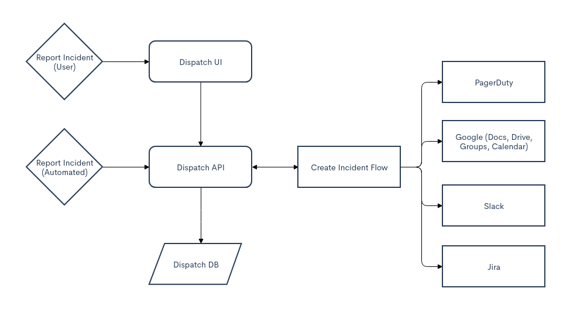

# Arts-026

## 1.Algorithm

460. [LFU缓存](https://leetcode-cn.com/problems/lfu-cache/)


设计并实现[最不经常使用（LFU）](https://baike.baidu.com/item/缓存算法)缓存的数据结构。它应该支持以下操作：`get` 和 `put`。

`get(key)` - 如果键存在于缓存中，则获取键的值（总是正数），否则返回 -1。
`put(key, value)` - 如果键不存在，请设置或插入值。当缓存达到其容量时，它应该在插入新项目之前，使最不经常使用的项目无效。在此问题中，当存在平局（即两个或更多个键具有相同使用频率）时，**最近**最少使用的键将被去除。

**进阶：**
你是否可以在 **O(1)** 时间复杂度内执行两项操作？

**示例：**

```java
LFUCache cache = new LFUCache( 2 /* capacity (缓存容量) */ );

cache.put(1, 1);
cache.put(2, 2);
cache.get(1);       // 返回 1
cache.put(3, 3);    // 去除 key 2
cache.get(2);       // 返回 -1 (未找到key 2)
cache.get(3);       // 返回 3
cache.put(4, 4);    // 去除 key 1
cache.get(1);       // 返回 -1 (未找到 key 1)
cache.get(3);       // 返回 3
cache.get(4);       // 返回 4
```


My Solution:**

```go
//双Hash链表实现
type Node struct {
	key, val, freq int
	prev, next *Node
}

type DoubleLink struct {
	head, tail *Node
}

func ConstructorDoubleLink() *DoubleLink {
	head, tail := &Node{}, &Node{}
	head.next, tail.prev = tail, head

	return &DoubleLink{
		head: head,
		tail: tail,
	}	
}

func (dl *DoubleLink) remove(node *Node) {
	node.prev.next= node.next
	node.next.prev = node.prev
	 node.next, node.prev = nil, nil
}

func (dl *DoubleLink) isEmpty() bool {
	return dl.head.next == dl.tail
}

func (dl *DoubleLink) addHead(node *Node) {
	node.next = dl.head.next
	node.prev = dl.head
	dl.head.next.prev = node
	dl.head.next = node
}

func (dl *DoubleLink) removeLast() *Node{
	if dl.isEmpty() {
		return nil
	}
	lastNode := dl.tail.prev
	dl.remove(lastNode)
	return lastNode
}

type LFUCache struct {
	cache map[int]*Node
	freqMap map[int]*DoubleLink
	size int
	capacity int
	minFreq int
}


func Constructor(capacity int) LFUCache {
	return LFUCache{
		cache:    make(map[int]*Node),
		freqMap:   make(map[int]*DoubleLink),
		size:     0,
		capacity: capacity,
		minFreq:  0,
	}
}


func (this *LFUCache) Get(key int) int {
	if node, ok := this.cache[key]; ok {
		this.incFreq(node)
		return node.val
	}
	return -1
}


func (this *LFUCache) Put(key int, value int)  {
	if (this.capacity == 0) {
		return
	}

	//if node exists, incFreq
	if node, ok := this.cache[key]; ok {
        node.val = value
		this.incFreq(node)
		return
	}
	if this.size >= this.capacity {
		// remove lfu node
		node := this.freqMap[this.minFreq].removeLast()
		delete(this.cache, node.key)
		this.size--
	}

	// create node and insert
	this.minFreq = 1
	node := &Node{
		key:  key,
		val:  value,
		freq: 1,
	}
	this.cache[key] = node
	if _, ok := this.freqMap[this.minFreq]; !ok {
		this.freqMap[this.minFreq] = ConstructorDoubleLink()
	}
	this.freqMap[this.minFreq].addHead(node)
	this.size++
}

func (this *LFUCache) incFreq(node *Node) {
	// remove old freq, update minFreq
	freq := node.freq
	this.freqMap[freq].remove(node)
	if freq == this.minFreq && this.freqMap[freq].isEmpty() {
		this.minFreq ++
	}

	// add node to new freqMap
	node.freq++
	if _, ok := this.freqMap[node.freq]; !ok {
		this.freqMap[node.freq] = ConstructorDoubleLink()
	}
	this.freqMap[node.freq].addHead(node)
}

```


## 2.Review

[Introducing Dispatch](https://netflixtechblog.com/introducing-dispatch-da4b8a2a8072)

本文介绍了Nexflix开源的危机管理框架Dispatch。Dispatch专注于创建资源，整合参与者，发送通知，跟踪任务和协助事后审查。它深度集成了Slack、GSuite、Jira等。

#### 危机管理的四大挑战

- 资源管理。不仅管理收集到的关于事件本身的数据，而且管理所有关于响应的元数据。
- 个人参与-了解与个人和团队接触的最佳方式，并根据事件上下文进行处理。
- 生命周期管理-提供事件指挥官（负责推动事件解决的个人）工具，以便轻松管理事件的生命周期。。
- 事件学习-在过去事件的基础上加快解决未来事件。


#### 检查清单

- 声明事件-潜在事件有许多不同的入口点：自动警报、内部通知或外部通知。
- 确定事件指挥官-根据事件源、类型和优先级，确定负责此特定事件的人员。
- 创建沟通渠道-事件期间的沟通是关键。建立专用和标准化的通信渠道可防止通信障碍。
- 创建事件文档-负责包含最新事件信息的中心文档，包括事件描述、资源链接、当面会议的粗略笔记、开放式问题、操作项和时间线信息。
- 使用个人资源-如果事件指挥官将无法自行解决事件，他们必须确定并使用组织内的其他资源来帮组解决问题。
- 单个资源的方向-如果投入额外的资源不够，事件指挥官需要调整这些资源。
- 通知关键利益相关者-对于任何事件，需要让 关键利益相关者了解事件。
- 推动事件的解决-事件的实际解决，创建任务，提出问题，并跟踪答案。记下决议后要解决的关键经验教训。
- 执行事故后审查（PIR）-审查如何执行事故过程，跟踪事故后要执行的行动，并通过构建结构话知识来推动学习。
- 这里每个步骤都有事件指挥官和事件参与者在各种系统和接口中移动。每个上下文切换都会增加响应者的认知负荷，分散他们解决事件本身的注意力。


#### 更好的危机管理，两个目标

- 重用用户已经熟悉的现有工具，减少学习曲线
- 编排、存储和分析我们的事故数据以加快解决问题速度。


#### Dispatch

- 虽然Dispatch不使用AWS API，但它利用了深深嵌入到组织中的多个API（例如Slack、GSuite、PagerDuty等）。除了所有内置的集成之外，Dispatch还提供了多个集成点，允许它几乎适应任何现有的环境。

- Dispatch的核心目标是管理一个事件的整个生命周期，专注于让个人参与进来，并为他们提供推动事件解决所需的环境。


#### 工作流


- 事件指挥官不再需要管理对资源或多个数据流的访问。

- 跨事件的通信是标准化的（包括样式和间隔）。

- 事件参与者根据事件的类型、优先级和描述自动参与。

- 如果未按时完成，则跟踪事件任务并提醒所有者。

- 所有事件数据都集中跟踪。

- 为内部用户和工具提供了一个通用的API。

- Dispatch使用两种常用工具来管理整个生命周期。用于管理事件元数据（如状态、标题、描述、优先级等）的Slack，以及用于管理数据本身的Google Doc和Google Drive。

- Dispatch提供了一个管理UI。此接口也是管理事件知识的地方。从通用术语及其定义，个人，团队和服务。管理UI是我们如何管理事件知识，以便在将来的事件中使用。

  

#### 开始

https://github.com/Netflix/dispatch


## 3.Tips
**curl 常用方法**

- 直接发送POST

```shell
curl -X POST https://www.google.com
```
- 发送POST，带body request参数

```shell
# -d / --data-urlencode
curl -d 'login=abc&password=123' https://google.com/login

# 也可以-d分开
curl -d 'login=emma' -d 'password=123' https://google.com/login
```

- 发送POST，允许自动跳转 `-L`

```shell
curl -d 'login=abc&password=123' -L https://google.com/login
```

- 发送POST，json 数据

```shell
curl -d '{"login": "abc", "pass": "123"}' -H 'Content-Type: application/json' https://google.com/login
```

- 发送文件

```shell
curl -d '@data.txt' https://google.com/login
```

- 发送图片文件

```shell
curl -F 'file=@photo.png;filename=changenewname.png' https://google.com/profile
```

- cookie

```shell
# store cookie
curl -c cookies.txt https://www.google.com
# load cookie
curl -b cookies.txt https://www.google.com
```

- 保存到文件

```shell
curl -o response.txt https://google.com?q=kit
```

- 忽略证书检查

```shell
curl -k https://google.com?q=kit
```

- 构建查询字符串

```shell
curl -G -d 'q=abc' -d 'count=20' https://google.com/search
# equal
curl https://google.com/search?q=abc&count=20
```

- debug

```shell
curl -v  https://google.com/search
curl --trace - https://google.com/search?q=abc&count=20
```


**go nil**

```go
var demo *string
println(demo) #0x0

// 变量声明为函数，默认为nil
var fn func(a, b int) int
println(fn == nil) //true

//切片
var soup []string
fmt.Println(soup == nil) //true

for _, ingredient := range soup {
  fmt.Println(ingredient)
}

fmt.Println(len(soup))//0

soup = append(soup, "onion", "carrot", "celery")
fmt.Println(soup) //[onion carrot celery]
```


## 4.Share

[Creating a Readable REST API](https://dzone.com/articles/creating-a-readable-rest-api)

本文介绍了创建可读REST API的一些要点：

- 注意复数和单数使用。譬如使用/api/v1/order/{id}，而不是/api/v1/orders/{id}。
- 除非显著修改，一般不要创建API版本，如果需要对现有方法进行更改（省略、错误、功能更改），请考虑创建替代方法。通常情况下，这比增加版本号要好。
- 在创建许多方法之间找到一个折中点，为获取特定数据提供最大的灵活性，维护数量有限的方法，这样有利于开发人员掌握。
- 按需输出，最小化开发人员对API调用。
- 遵守惯例，如果使用PUT创建实体的新实例，请使所有方法都使用PUT创建实例，并使用POST/PATCH编辑实例，反之亦然。
- 使用Swagger来记录API。它已经成为一种行业标准，可读性能提高10倍。
- 为每种方法提供示例。
- 遵循错误响应对象中的约定，并使用正确的错误代码提供有意义的异常消息。提示：“发生错误”不是一个好的错误消息。同样，最好告诉开发人员缺少什么输入参数，或者输入的值无效。

