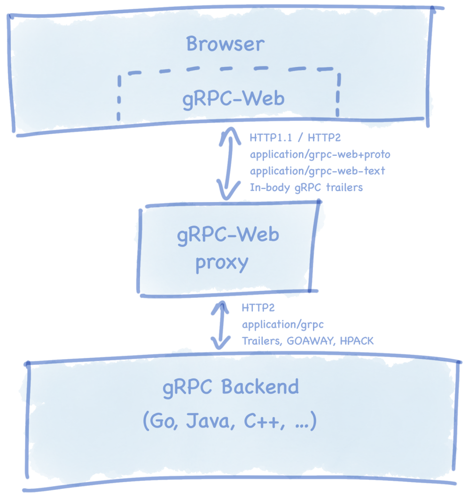

# Arts-027

## 1.Algorithm

72. [编辑距离](https://leetcode-cn.com/problems/edit-distance/)

给你两个单词 *word1* 和 *word2*，请你计算出将 *word1* 转换成 *word2* 所使用的最少操作数 。

你可以对一个单词进行如下三种操作：

1. 插入一个字符
2. 删除一个字符
3. 替换一个字符


**示例 1：**

```
输入：word1 = "horse", word2 = "ros"
输出：3
解释：
horse -> rorse (将 'h' 替换为 'r')
rorse -> rose (删除 'r')
rose -> ros (删除 'e')
```

**示例 2：**

```
输入：word1 = "intention", word2 = "execution"
输出：5
解释：
intention -> inention (删除 't')
inention -> enention (将 'i' 替换为 'e')
enention -> exention (将 'n' 替换为 'x')
exention -> exection (将 'n' 替换为 'c')
exection -> execution (插入 'u')
```


**My Solution:**

```go

func minDistance(word1 string, word2 string) int {
	m, n := len(word1), len(word2)

	d := make([][]int, m + 1)
	for i := 0; i <= m; i++ {
		d[i] = make([]int, n + 1)
	}

	for i := 0; i <= m; i++ {
		d[i][0] = i
	}

	for j :=0; j <= n; j++ {
		d[0][j] = j
	}

	//dynamic programming
	for i := 1; i <= m; i++ {
		for j := 1; j <= n; j ++ {
			if word1[i-1] == word2[j-1] {
				d[i][j] = d[i-1][j-1]
			} else {
				d[i][j] = d[i-1][j-1] + 1
			}
			d[i][j] = min(d[i][j], d[i][j-1] + 1)
			d[i][j] = min(d[i][j], d[i-1][j] + 1)
		}
	}
	return d[m][n]
}

func min(num1 int, num2 int) int {
	if num1 > num2 {
		return  num2
	}
	return num1
}
```


## 2.Review

[gRPC Motivation and Design Principles](https://grpc.io/blog/principles/)

google内部一直使用Stubby进行微服务架构实践，随着SPDY，HTTP / 2和QUIC的出现，许多相同的功能以及Stubby不提供的其他功能已出现在公共标准中。grpc对Stubby进行标准化和适用性扩展。具体设计原则有：

- 服务不是对象，消息不是引用。在系统间进行粗粒度消息交换。避免[分布式对象](https://martinfowler.com/articles/distributed-objects-microservices.html)的 [陷阱](https://martinfowler.com/articles/distributed-objects-microservices.html)和[忽略网络](https://en.wikipedia.org/wiki/Fallacies_of_distributed_computing)的 [谬误](https://en.wikipedia.org/wiki/Fallacies_of_distributed_computing)
- 覆盖范围和简单性。可以在各个平台使用，易于构建应用，可以在CPU和内存受限环境运行。
- 免费开放。使用免费开源许可。
- 互操作和覆盖面。支持普通互联网应用。
- 通用性和性能。应用广泛，不同调用栈性能影响小。
- 分层。不同关键层面能够独立发展，协议层的修订不影响应用层。
- 不确定载荷。不同的服务需要使用不同的消息类型和编码，例如协议缓冲区，JSON，XML和Thrift。协议和实现必须考虑到这一点。同样，对有效负载压缩的需求因用例和有效负载类型而异：协议应允许使用可插拔压缩机制。
- 流。存储系统通过流和流控制来操作大型数据集。其他服务，例如语音转文本或股票行情通过流来表示时间相关的消息序列。
- 阻塞和非阻塞。支持异步和同步处理客户端和服务器交换的消息序列。
- 消息和超时。操作可能很昂贵且长时间保持-取消功能允许服务器回收资源。跟踪因果关系链时，取消可能会级联。客户端可以声明超时，这允许服务根据客户端的需求调整其行为。
- 平滑关闭。
- 流量控制。客户端和服务器之间的计算能力和网络容量通常不平衡。流控制不仅可以实现更好的缓冲区管理，还可以提供DOS保护。
- 可插拔。大型分布式系统需要安全性，运行状况检查，负载平衡和故障转移，监视，跟踪，日志记录等。实现应提供扩展点，以允许插入这些功能以及默认实现。
- 扩展采用API。需要服务之间协作的扩展应优先使用API，而不是协议扩展。可能包括运行状况检查，服务自省，负载监视和负载平衡分配。
- 元数据交换。常见的跨领域问题（例如身份验证或跟踪）依赖于不属于服务的已声明接口的一部分的数据交换。部署依赖于公开的各个API。
- 标准化状态码。客户端通常以有限的方式响应API调用返回的错误。应该限制状态代码名称空间，以使这些错误处理决策更清晰。如果需要更丰富的特定于域的状态，则可以使用元数据交换机制来提供该状态。


## 3.Tips
Vim 普通用户启动时保存需要root权限操作的文件，有时忘了加sudo，导致编辑的文件无法保存。
```shell
:w !sudo tee %
```
Vim 通过`!`表示后面部分是外部命令。上面命令相当于执行:`cat file |sudo tee %` ,可以使用重定向方案

```shell
:w !sudo -sh -c "cat > %"
```

进一步通过定义快捷键

````shell
cmap w@ w !sudo sh -c "cat > %"
````


## 4.Share

分享技术文章：[The state of gRPC in the browser](https://jbrandhorst.com/post/state-of-grpcweb/)

本文介绍浏览器中gRPC的一些历史,分享对未来的一些想法。

- gRPC-Web规范。gRPC-Web规范从HTTP / 2规范的角度出发，然后定义差异。这些主要包括：
  - 同时支持HTTP / 1.1和HTTP / 2。

  - 在请求/响应主体的末尾发送gRPC预告片，如gRPC消息标头[head](https://jbrandhorst.com/post/state-of-grpcweb/#f4)的新位所示。

  - 在gRPC-Web请求和gRPC HTTP / 2响应之间进行转换的必需代理。

  - 实现方案：让浏览器发送正常的HTTP请求（使用Fetch或XHR），并在gRPC服务器的前面使用代理，以将请求和响应转换为浏览器可以使用的内容。

  
- 两种实现

  - google和Improbable团队分别进行了实现，并有轻微不同，也都没有完全符合方案标准。

  - 主要区别：

    | Client / Feature       | Transport | Unary | Server-side streams                                       | Client-side & bi-directional streaming                    |
    | :--------------------- | :-------- | :---- | :-------------------------------------------------------- | :-------------------------------------------------------- |
    | Improbable             | Fetc️h/XHR | ✔️     | ✔️                                                         | ❌[19](https://jbrandhorst.com/post/state-of-grpcweb/#f19) |
    | Google (`grpcwebtext`) | XHR ️      | ✔️     | ✔️                                                         | ❌                                                         |
    | Google (`grpcweb`)     | XHR ️      | ✔️     | ❌[20](https://jbrandhorst.com/post/state-of-grpcweb/#f20) | ❌                                                         |

    

- 未来
  - Google实施于2018 [年](https://jbrandhorst.com/post/state-of-grpcweb/#f21) 10月[21](https://jbrandhorst.com/post/state-of-grpcweb/#f21)宣布了1.0版并全面上市，并发布了未来目标的路线图：
    - 高效的类似于JSON的消息编码
    - 适用于Node，Python，Java等的进程内代理
    - 与流行的框架（React，Angular，Vue）集成
    - 提取API传输以实现高效内存传输
    - 双向流支持

- 结论
  - 在两个代理之间进行选择时，功能没有差异，因此这取决于部署模型。Envoy将适合某些情况，而进程内Go代理具有其自身的优势。
  - 开始使用gRPC-Web，请首先尝试使用Google客户端。它具有严格的API兼容性保证，并建立在Gmail和Google Maps使用的坚如磐石的Google Closure库基础上。
  - 如果您*需要* Fetch API内存效率或实验性的Websocket客户端和双向流传输，则Improbable客户端是一个不错的选择，Improbable将继续使用和维护它。